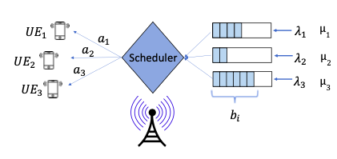

# 5G Downlink Scheduling System with Dimension Reduction

## Overview
This project focuses on the study of a 5G downlink scheduling system, as illustrated in the diagram below:

The main objective is to develop an efficient scheduling policy that minimizes the queuing delay experienced by the users. In other words, the goal is to minimize the sum-delay experienced by the users.

## Project Status
The project is currently under construction, and efforts are being made to enhance its structure and modularity. The primary task at hand is to separate the files from the .ipynb (Jupyter Notebook) format into different .py (Python) files. This modular approach will facilitate better code organization and improve overall project maintainability.

## Project Structure
The project structure is evolving, but the primary components include:
- **src/**: Contains the source code files.
- **notebooks/**: Houses the Jupyter Notebooks used for initial exploration and analysis.
- **data/**: Stores any relevant data used in the project.
- **docs/**: Documentation related to the project.
